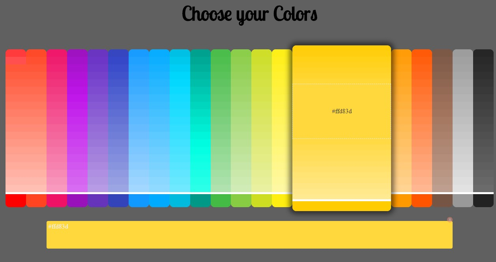
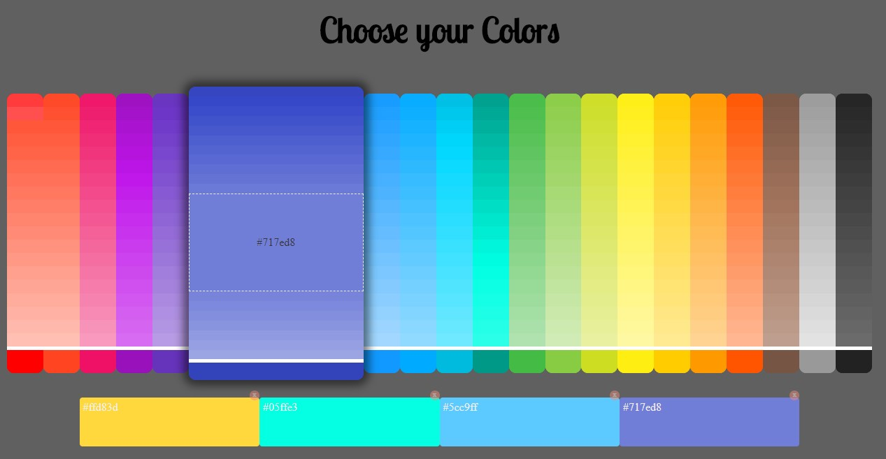

# ♡ COLOR PICKER ♡

## Objetivo

Entender de forma práctica las expresiones regulares, su uso y apliación en un código, con objetivo de crear una UI útil y práctica para cualquier FED.

1. Escribir un programa que compare el número del color hexadecimal con el número RGB.

2. Presentar los colores ordenados por espectro lumínico  te permita seleccionar hasta 6 para que puedas formaruna paleta de colores y usuar los número hexadecimales en tu código más fácilmente.

